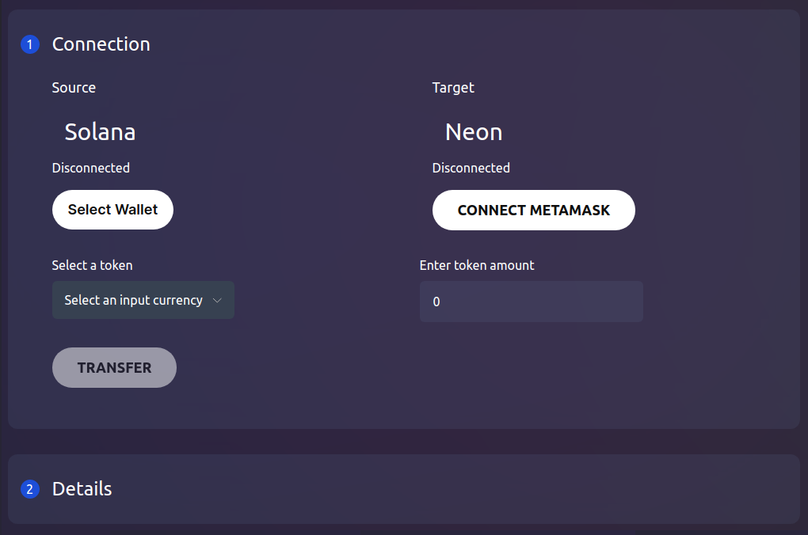
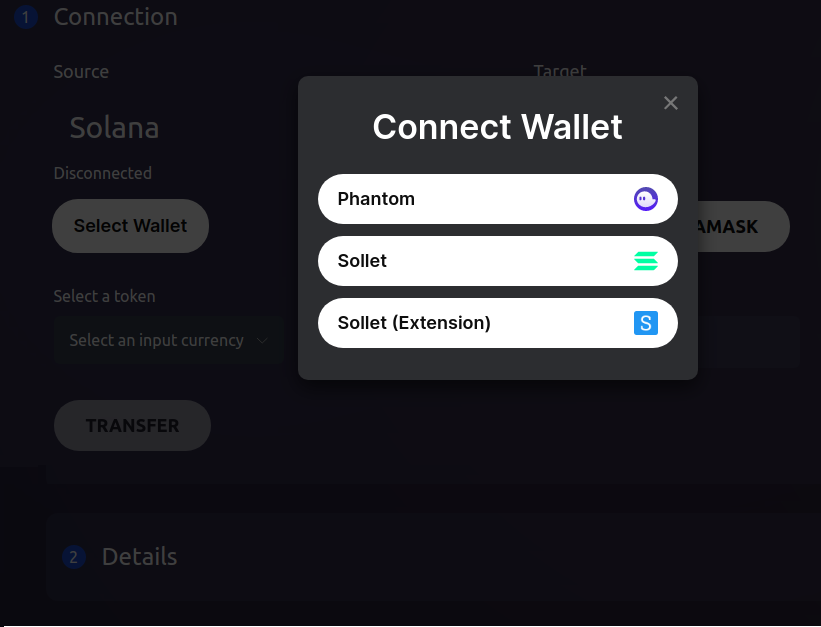
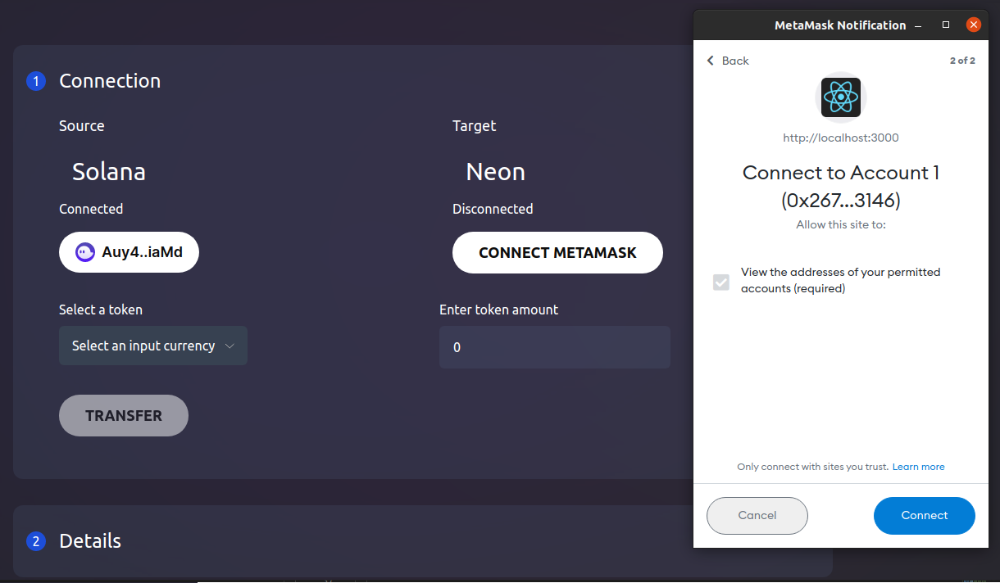
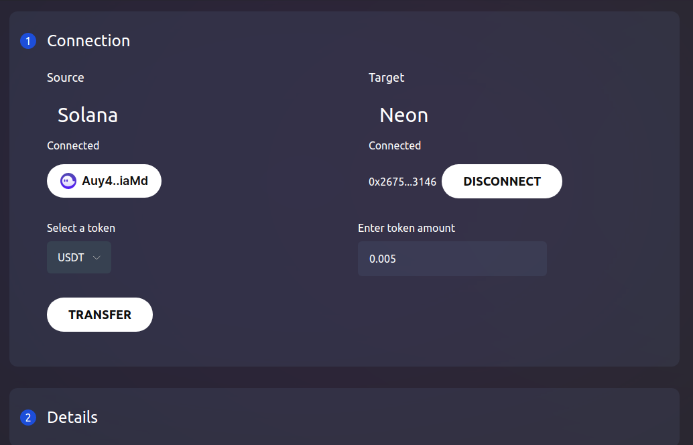
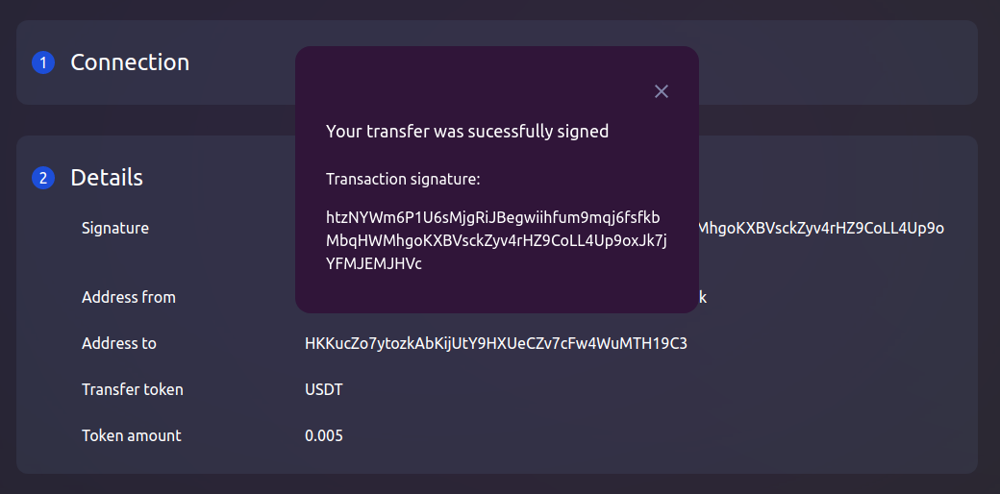

# How to Transfer SPL Tokens to Neon EVM

## Goal
Transfer SPL custom tokens from the Solana blockchain to the ERC-20 account balance in Neon EVM via the Neon bridge.

*Conditions:*
  * You have an account in Neon EVM.
  * The SPL token can be SOL, ETH, USDT, or USDC.
  * The Neon Bridge application is used as a browser.

## Before you begin
  * Understand the following:
    * What is the [Solana network](https://docs.solana.com/clusters).
    * What is the [Metamask](https://docs.neon-labs.org/docs/glossary#metamask).
    * What is the [Phantom](https://docs.neon-labs.org/docs/glossary#phantom).
  * Both [Metamask](https://docs.neon-labs.org/docs/glossary#metamask) and [Phantom](https://docs.neon-labs.org/docs/glossary#phantom) must be installed on your device and can be accessed from the browser you are using.
  * Learn the guide ["How to Connect Metamask to Solana's Network"](https://docs.neon-labs.org/docs/software_manuals/how_to_guides/connect_metamask_to_solana).

## Steps
The application uses Metamask and Phantom — two popular non-custodial browser based wallets. This pair of wallets gives users the ability to transfer SPL tokens to Neon EVM.

### Step 1. Open the Neon Bridge application
Go to the main [Neon](https://neon-labs.org/) page and open the `NeonPass` tab to call the Solana-Neon token transfer application.

### Step 2. Connect the Phantom wallet to Solana
Click `Select Wallet` on the left hand side of the screen. You will have an option to connect up wallets. You have to select the Phantom (recommended) wallet to connect to the Solana network.

The `Select Wallet` field will be changed to the public key of the account in Solana. You can see `Connected` at the top of the field. This means that the user authorizes the application to use this key to sign transactions. Phantom stores sets of account keys, but does not store any balances. To obtain balances, Phantom will refer to the Solana blockchain.

### Step 3. Connect the Metamask wallet to Neon EVM
Click `Connect Metamask` on the right hand side of the screen. If you do not have an account created before on the Neon EVM network, you must do so now following the [instructions](https://docs.neon-labs.org/docs/software_manuals/how_to_guides/connect_metamask_to_solana). In the dropdown window `Metamask Notification` you will see the public key of the account in Neon EVM. 

Click `Connect` to complete the connection. The `Connect Metamask` field will be changed to the account's public key connected to the Neon EVM network. You can see `Connected` at the top of the field.

### Step 4. Select the ERC-20 token and sign the transaction

Now you need to select the token symbol from the list of ERC-20 tokens available to the application and specify the amount to be transferred.

Check the completed fields and click `Transfer` to sign and send the transaction.

### Step 5. Check the results of the completed transaction.

Open the `Details` tab located below. The application will display you the results of the completed transaction, including the sender and recipient addresses, as well as the symbol and amount of the transferred tokens.

After crediting tokens to the account balance in Neon EVM, you can swap them to NEON to pay for the gas required for each transaction to execute. To do so you can use the Neonswap application.
